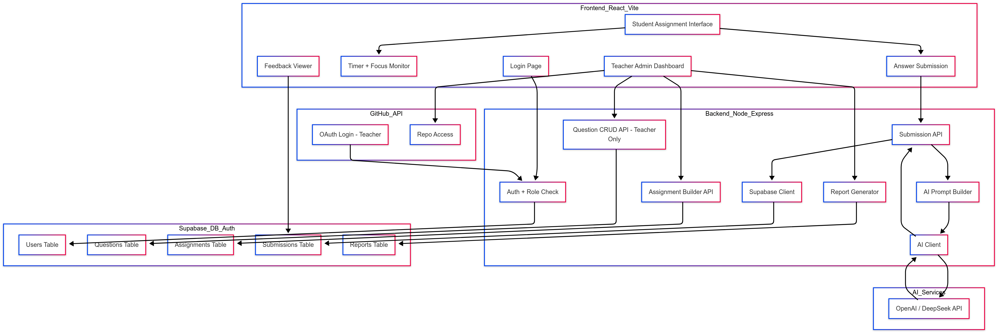

### Components

1. **Frontend (React + Vite + Bootstrap + React Router)**  
   **Purpose**: User interface for students and teachers  
   **Tech**:
   - React with Vite  
   - Bootstrap for styling  
   - React Router for navigation  

   **Main Features**:
   - Student login page  
   - Exam screen with:  
     - Timer  
     - Browser focus detection  
     - Question rendering (MCQ + code editor)  
   - Real-time feedback display  
   - Teacher dashboard:  
     - Add/manage questions  
     - View student submissions + reports  
     - AI-powered question generation (optionally)

2. **Backend (Node.js + Express)**  
   **Purpose**: Handles logic, APIs, AI prompt generation, and access control  
   **Responsibilities**:
   - Auth & role check (student/teacher) via Supabase Auth or GitHub OAuth  
   - API endpoints for:  
     - Submissions (student answers)  
     - Question CRUD operation for teacher only  
     - Assignment creation  
     - AI interaction (generate feedback/questions) (optionally)  
     - Report generation  
   - Role-based access protection for teacher APIs

3. **AI Integration (OpenAI / DeepSeek)**  
   **Purpose**: Evaluate student answers and assist teachers  
   **Functions**:
   - Accepts a student’s answer and the original question  
   - Returns:  
     - Correctness check  
     - Feedback (corrects & mistakes)  
     - Suggestions  

4. **Supabase (Database + Auth)**  
   **Purpose**: Authentication, authorization, and data storage  
   **Tables**:
   - `users`: id, email, role (student/teacher)  
   - `questions`: id, type, prompt, choices, correctAnswer  
   - `assignments`: id, title, questionId, duration  
   - `submissions`: studentId, questionId, answer, AIfeedback, score  
   - `reports`: assignmentId, summary, downloadLinks  

5. **GitHub API (Optional for Teachers)**  
   **Purpose**: Auth & repository-based tasks  
   **Use Cases**:
   - Teacher login via GitHub OAuth  
   - Access linked student repositories for review or code-based tasks  

### Data Flow (End-to-End)

#### Student Workflow
1. Student logs in via Supabase  
2. Opens assignment from assignment list  
3. Timer + focus monitoring starts  
4. Answers MCQs and writes code  
5. On submit:  
   - Answer is sent to backend  
   - Backend creates prompt for AI  
   - AI returns feedback + scores  
   - Results saved in submissions table  
6. Student sees immediate feedback  

#### Teacher Workflow
1. Teacher logs in via GitHub OAuth or Supabase  
2. Admin Dashboard is displayed only for teacher  
3. Teacher:  
   - Adds/edits questions  
   - Creates assignments from question pool  
   - Views student submissions and auto-generated feedback  
   - Generates reports (CSV/JSON)  

### Architecture Diagram

