# 🚀 AI Feedback Platform – Smarter Learning & Teaching with AI 🧑‍🎓🧑‍🏫✨

[](https://opensource.org/licenses/MIT)
[](https://react.dev/)
[](https://nodejs.org/)
[](https://supabase.com)

## 📄 Description

**AI Feedback Platform** is a comprehensive **browser-based web application** built for **students** and **teachers** to streamline **assignments, exams, feedback, and learning** through the power of **Artificial Intelligence**.

---

## 🎯 Key Features

### ✅ For Students:

- Complete weekly assignments and exams including **multiple-choice** and **coding tasks**.
- Receive **instant, personalized feedback** powered by AI, 
- Timed assignments with browser focus tracking
- Access feedback designed to help you **learn, improve, and succeed**.

---

### ✅ For Teachers:

- Monitor and manage student assignments and exams via a **teacher dashboard**.
- Review student performance and AI-generated feedback with **AI assistance**.
- Export Ai feedback as text files for easy sharing and review.
- Generate, configure, and schedule assignments easily.
- All results and interactions are securely stored in **Supabase**.

---

## 🔧 Tech Stack

- **Frontend:** React + Vite
- **Backend:** Node.js + Express
- **AI Integration:** OpenAI / Cohere / DeepSeek API
- **Database:** Supabase

## 👥 Team

|       Name       |  GitHub Name |                       Role                          |
|------------------|--------------|-----------------------------------------------------|
| Sujeewa Herath   | SampathHM    | Frontend and backend Developer / Project Management |
| Upeksha Chiranthi| upeksha-c    | Frontend and backend Developer / Project Management |
| Archana Ojha     | ojhaarch2054 | Frontend and backend Developer / Project Management |
| Nipuni Kodikara  | t3komu00     | Frontend and backend Developer / Project Management |


## 🔗 APIs Used

We integrated multiple AI APIs to provide personalized feedback, error analysis, and solution suggestions for students' answers.

---

### 1. Cohere API
- **Description:**  
  Cohere focuses on natural language understanding, making it suitable for generating concise feedback, text classification, and summarization.
- **Pros:**
  - Cost-effective for text-focused tasks.
  - Strong in maintaining tone consistency and clarity.
  - Easy to integrate with clear API documentation.
- **Cons:**
  - Limited capabilities for complex code-related tasks.
  - Less effective in multi-step reasoning or advanced technical explanations.

---

### 2. OpenRouter AI
- **Description:**  
  OpenRouter AI provides access to multiple open-source and commercial AI models via a single API interface. It is used for generating personalized and context-aware feedback.
- **Pros:**
  - Flexibility to switch between multiple models (including open-source and advanced models).
  - Pay-as-you-go model cost-effective for small projects.
  - Ideal for natural language tasks and creative text generation.
- **Cons:**
  - Quality depends on the selected model some models may underperform.
  - Less predictable behavior compared to single-provider APIs.

---

### 3. DeepSeek API
- **Description:**  
  DeepSeek AI specializes in code generation, explanation, and problem-solving, making it ideal for programming-related feedback.
- **Pros:**
  - Fast response time.
  - Strong performance on code-related questions and technical answers.
  - Competitive pricing for AI code assistance.
- **Cons:**
  - Sometimes less accurate for abstract or non-technical content.
  - Smaller community and fewer resources for troubleshooting.

---

✅ We selected these AI APIs to balance **quality**, **cost**, and **task suitability**, ensuring the best experience for both students and teachers.


## 🚀 Installation & Setup Guide

This guide walks you through setting up the **Student AI Feedback System** on your local machine. The system consists of:


### ✅ Frontend Setup (React + Vite)

#### Prerequisites:

- Node.js (v18 or higher) ➔ [Download Node.js](https://nodejs.org/)
- npm (comes with Node.js) or yarn
- A Supabase project ➔ [https://supabase.io/](https://supabase.io/)
- AI API Keys:
  - [Cohere](https://cohere.ai/)
  - [OpenRouter AI](https://openrouter.ai/)
  - [DeepSeek](https://deepseek.com/)

#### Steps:

1. **Clone the Frontend Repository:**

   ```bash
   git clone https://github.com/AI-based-Automated-Feedback-Tool/AI-Feedback-Tool.git
   cd frontend-repo
    ```

2. **Install Frontend Dependencies:**

   ```bash
   npm install
   ```
  
3. **Create a `.env` file in the root directory:**

    ```bash
    VITE_SUPABASE_URL=your_supabase_url
    VITE_SUPABASE_ANON_KEY=your_supabase_anon_key    
    ```
  
    Replace the placeholders with your actual API keys and Supabase credentials.


4. **Start the Frontend Server:**

   ```bash
   npm run dev
   ```
  The frontend will be running at `http://localhost:5173`


### ✅ Backend Setup (Node.js + Express)

#### Prerequisites:
- Node.js (v18 or higher) ➔ [Download Node.js](https://nodejs.org/)
- npm (comes with Node.js) or yarn
- A Supabase project ➔ [https://supabase.io/](https://supabase.io/)
- AI API Keys:
  - [Cohere](https://cohere.ai/)
  - [OpenRouter AI](https://openrouter.ai/)
  - [DeepSeek](https://deepseek.com/)
  
#### Steps:
1. **Clone the Backend Repository:**

   ```bash
   git clone https://github.com/AI-based-Automated-Feedback-Tool/AI-Feedback-Tool-Backend.git
    cd backend-repo
    ```

2. **Install Backend Dependencies:**

    ```bash
    npm install
    ```

3. **Create a `.env` file in the root directory:**

    ```bash
    SUPABASE_URL=your_supabase_url
    SUPABASE_SERVICE_ROLE_KEY=your_supabase_service_role_key
    COHERE_API_KEY=your_cohere_api_key
    OPENROUTER_API_KEY=your_openrouter_api_key
    DEEPSEEK_API_KEY=your_deepseek_api_key
    OPENAI_API_KEY=your_openai_api_key
    PORT=3000
    ```
    Replace the placeholders with your actual API keys and Supabase credentials.
    
4. **Start the Backend Server:**

    ```bash
    npm run start
    ```
    
    The backend will be running at `http://localhost:3000`
  

---
---

## 🔗 UI Wireframe (Figma)

You can view the UI wireframe here: [Click to open Figma Design](https://www.figma.com/design/pk7MWiVJ9oJxGG89NFyQTW/AI-Powered-Exam---Assignment-Web-App?node-id=1-20&t=79hujBb7N1vTSMNq-1)

---
---

## 👥 User Onboarding Flow (Teacher & Student)

This section explains how both **teachers and students** can sign up, log in, and start using the system.  
Follow the steps below, and refer to the screenshots provided for a visual guide.

---

### 1️⃣ Landing Page – "AI-Based Automated Feedback Tool"

<div align="center"> 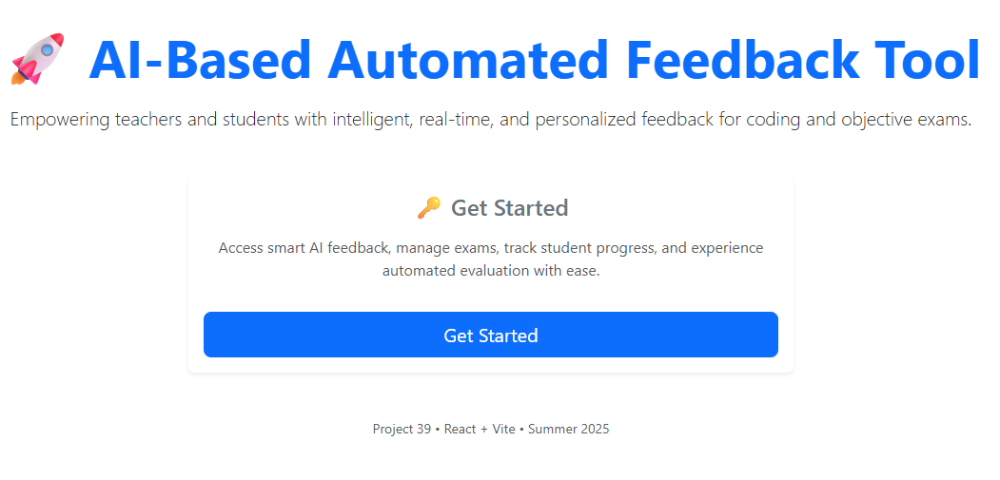 </div>


- When you visit `http://localhost:5173`, you will see the **Intro Page**.
- Click the **"Get Started"** button to begin.

---

### 2️⃣ Login Page

<div align="center"> 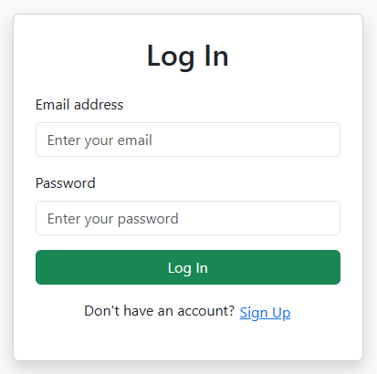 </div>

- If you already have an account, enter your **email** and **password** here.
- Click **"Login"** to access your dashboard.
- If you are new, click the **"Sign Up"** link below the login button.

---


### 3️⃣ Sign Up Page

<div align="center"> 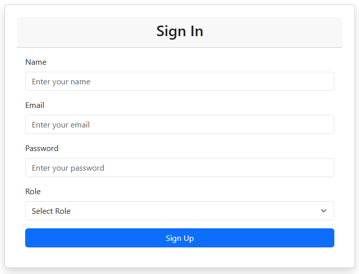 </div>

- Fill in the following fields to create an account:
  - **Full Name**
  - **Email**
  - **Password**
  - **Role** ➔ Choose **Teacher** from the dropdown
- Click **"Sign Up"** to register.
- The system will store your role and details securely in Supabase Auth.

---

### 4️⃣ Post-Login Redirection

- After login:
  - If you signed up as a **teacher**, you will be redirected to the **Teacher Dashboard**.
  - If you signed up as a **student**, you will be redirected to the **Student Dashboard**.

✅ Your role is automatically detected based on what you selected during signup.

---

### 🔐 Authentication Notes

- User authentication is handled by **Supabase Auth**.
- The `role` (student/teacher) is stored as user metadata in Supabase and used to control access.
- Unauthorized users cannot access teacher-specific routes.

---

## 👤 Teacher Profile Page

The **Teacher Profile Page** allows teachers to view and manage their personal information. It provides a clean and intuitive interface with an avatar, name, and email address display. Users can also update their name through the Edit Profile form.

### 🔍 View Profile
- Displays the teacher's **name** and **email address**.
- Shows a circular avatar based on the teacher’s initial.
- Includes an **Edit Profile** button for updating profile details.

<div align="center">
  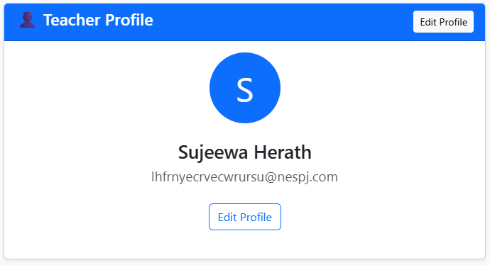
</div>

---

### ✏️ Edit Profile
- Allows the teacher to update their **name**.
- **Email field** is shown as read-only for security.
- Includes **Save Changes** and **Cancel** buttons for interaction.

<div align="center">
  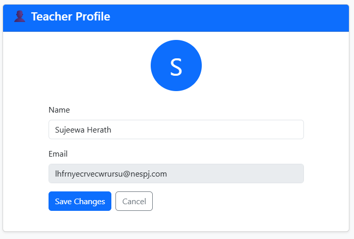
</div>

---

## 👨‍🏫 Teacher Dashboard

The Teacher Dashboard provides a central interface for educators to manage their courses, exams, and student feedback with ease.

<div align="center"> 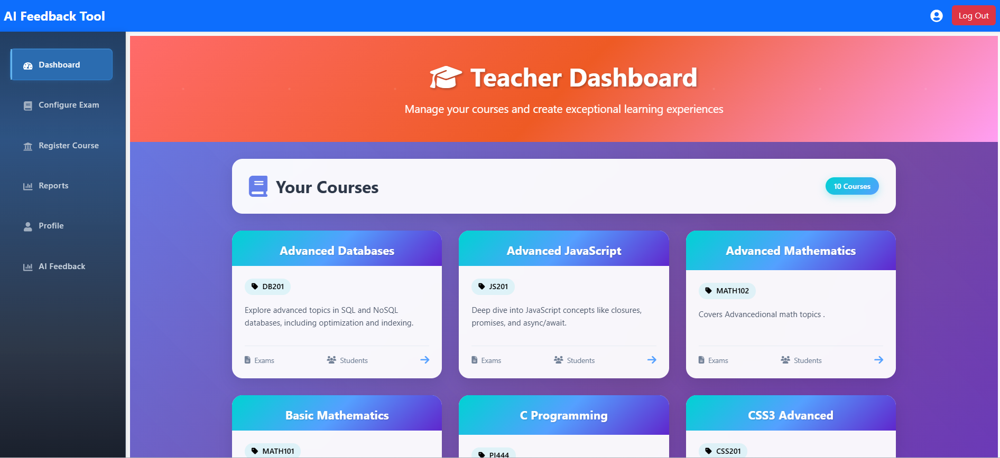 </div>


### 🧩 Features

- **📚 Course Cards**
  - Displays all courses assigned to the teacher.
  - Each course is presented as a clickable card.
  - Cards show:
    - **Course Title**
    - **Course Code**
    - **Brief Description**

- **🧭 Sidebar Navigation**
  - `Dashboard` – Home view showing teacher's courses.
  - `Configure Exam` – Set up exams for selected courses.
  - `Register Course` – Register new courses to the system.
  - `Reports` – View student performance and analytics.
  - `AI Feedback` – Access AI-generated feedback for student answers.
  - `Profile` – Manage teacher profile information.

- **🔝 Top Bar**
  - Profile icon leading to the profile page.
  - Red **Log Out** button to securely exit the dashboard.


### 🎯 Purpose

The Teacher Dashboard ensures that instructors can quickly navigate between their teaching resources, configure exams, register new courses, and leverage AI tools to enhance educational delivery.

---

## 📄 Course Exams Page

When a teacher clicks on a specific course card in the **Teacher Dashboard**, they are navigated to the **Course Exams Page**. This page displays a detailed list of all the exams created under that course.

### 🎯 Purpose

This page enables teachers to:

- View all exams associated with the selected course.
- See exam types (e.g., MCQ, CODE, ESSAY), durations, number of questions, and due dates.
- Manage or create new exams with ease.

### 📘 Example: `JS201 - Advanced JavaScript`

> The page title reflects the selected course (e.g., `JS201 - Advanced JavaScript`), providing context for the listed exams.

### 🧾 Page Preview

<div align="center">
  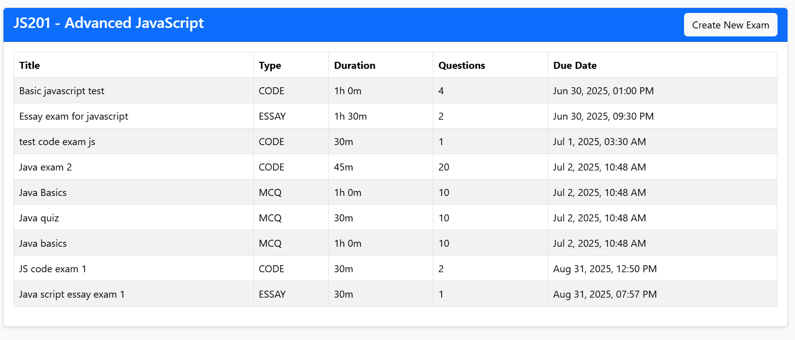
</div>

### 📋 Exam Table Overview

| Field        | Description                                      |
|--------------|--------------------------------------------------|
| **Title**    | Name of the exam (e.g., "Basic JavaScript test") |
| **Type**     | Exam type: `MCQ`, `CODE`, or `ESSAY`             |
| **Duration** | Time allowed for the exam                        |
| **Questions**| Number of questions in the exam                  |
| **Due Date** | Date & time the exam is due                      |

Each row in the table corresponds to one exam under the selected course.

### ➕ Create New Exam

A **"Create New Exam"** button is available in the top-right corner. Clicking it opens a form for adding a new exam to the current course.

---


## 🛠️ Configure New Exam

The **Configure New Exam** page allows teachers to create and customize a new exam with complete control over scheduling, instructions, grading criteria, and question types.

---

### 🧾 Basic Information
- **Exam Title**: Input a descriptive name for the exam (e.g., *Data Structures Final Exam*).
- **Course**: Select the relevant course from a dropdown menu populated from the course database.
- **Exam Duration (Minutes)**: Define the estimated time (in minutes) students will have to complete the exam.
- **Start Time / End Time**: Set the specific exam availability window using date-time pickers.

---

### 📜 Exam Rules & Instructions
- **Student Instructions**: Add important rules and guidelines for students, such as:
  - Allowed materials during the exam.
  - Submission expectations and formatting.
- These instructions are visible to students during the exam.

---

### 🧠 Grading Configuration
- **AI Assessment Guidelines**: Teachers can define automated grading rules to be followed by the AI engine:
  - e.g., *Points deduction for late submissions* or *Requirement of code documentation*.
  
- **Question Type**: Choose the type of questions for the exam using a dropdown menu:
  - `Multiple Choice Questions`
  - `Programming Code`
  - `Essay`

- **Total Questions**: Specify the number of questions to include in the exam (e.g., `15`).

---

### ✅ Action
- **Save & Proceed to Questions**: Button at the bottom lets the teacher confirm configurations and move to the question creation interface.

---
<div align="center">
  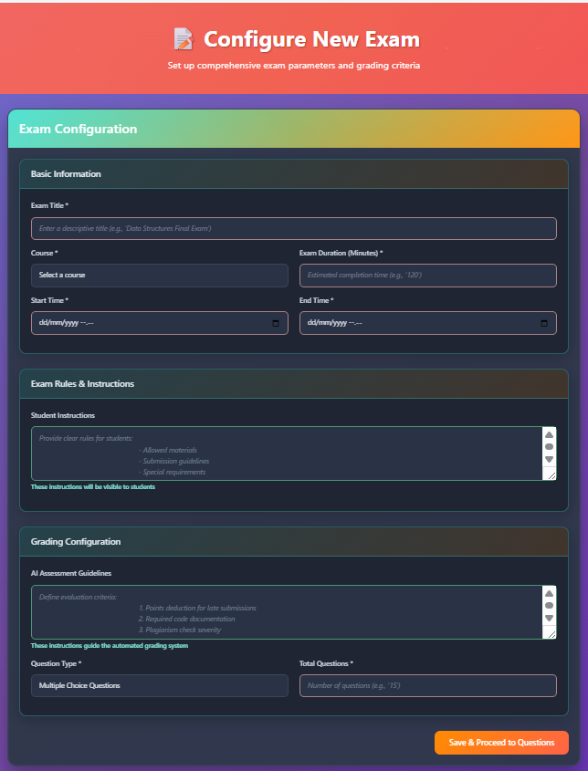
</div>


## ❓ Create MCQ Questions

The **Create MCQ Questions** page allows instructors to add multiple-choice questions to the exam configured previously. This interface provides fields to define the question, answer choices, correct answers, and point value—ensuring each question is clearly defined and ready for automated assessment.

---

### 🔹 Question Setup

- **Question \***: Input the actual question text you want students to answer.
  - Example: *Which array method adds one or more elements to the end of an array?*

- **Answer Options \***: Enter up to 4 possible answer choices.
  - Example: `push()`, `pop()`, `shift()`, `unshift()`

- **No of answers \***: Indicate how many answers the student is expected to select (e.g., `1` for single answer, `2+` for multi-answer questions).

- **Select Correct Answer(s) \***: Check the box(es) for the correct answer(s). This is used to validate student responses automatically.

- **Number of points \***: Assign the point value for the question based on its difficulty or importance (e.g., `2` points).

- **+ Save Question**: Adds the current question to the list below for review before final submission.

---

### 🔍 Preview Questions

Below the input form is a **Preview Questions** section, where teachers can review all added questions in tabular format before finalizing.

#### Table Columns:
- `#`: Question number in sequence.
- `Question`: Displays the text of the question.
- `Points`: Shows how many points are awarded for a correct answer.
- `No of answers`: Indicates how many answers are correct.
- `Answer options`: Lists all the provided answer choices.
- `Correct Answers`: Displays which option(s) were marked as correct.
- `Actions`:
  - **Edit**: Modify the question details.
  - **Delete**: Remove the question from the list.

- **+ Save All Question**: Submits all created questions to be linked with the exam.

---

<div align="center">
  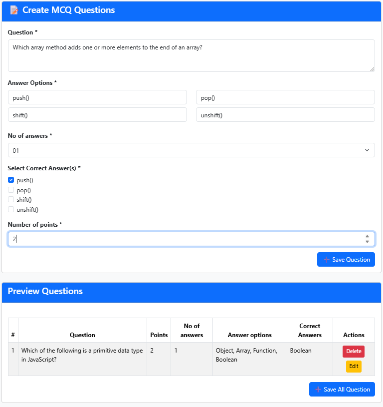
</div>

> ⚠️ **Note on Question Types**
>
> The interface for creating questions dynamically changes based on the selected **Question Type** from the exam configuration step:
>
> - **Multiple Choice Questions (MCQ)**:
>   - Displays fields to enter a question, multiple answer options, select the correct answer(s), and assign point value.
>   - Supports both single and multiple correct answers.
>
> - **Programming Code Questions**:
>   - Includes fields to define the problem description, input/output expectations, and any code boilerplate.
>   - Teachers can optionally define test cases and expected output for automatic evaluation.
>
> - **Essay Questions**:
>   - Provides a rich text area for the teacher to enter the essay prompt or topic.
>   - Essay answers will be manually or AI-evaluated based on the guidelines set during exam configuration.
>
> This modular behavior ensures that each type of question receives the appropriate structure and validation criteria tailored to its nature.


## 🧠 AI Feedback - Select Exam

<div align="center">
  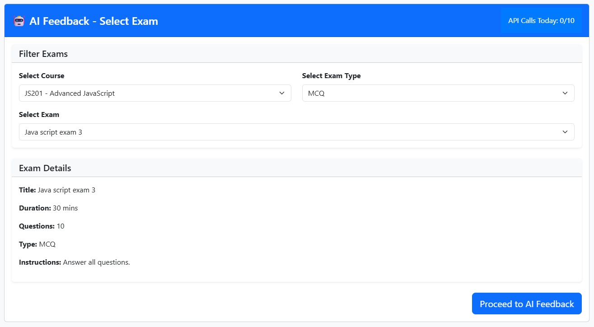
</div>

This page allows teachers to filter and select an exam before generating AI-based feedback.

### 🔹 Filter Exams

To proceed with generating feedback, the teacher must complete the following steps:

- **Select Course**  
  Choose the relevant course from the dropdown. Example:  
  `JS201 - Advanced JavaScript`

- **Select Exam Type**  
  Choose the type of exam from the available options:
  - Multiple Choice Questions (MCQ)
  - Programming Code
  - Essay

- **Select Exam**  
  Pick the specific exam related to the selected course and exam type.

  ### 🔸 Exam Details

Once all selections are made, the exam details are displayed:

- **Title**: Java script exam 3  
- **Duration**: 30 mins  
- **Questions**: 10  
- **Type**: MCQ  
- **Instructions**: Answer all questions.

> ℹ️ This interface adapts based on the **exam type**:
> - MCQ exams lead to an objective-based feedback view.
> - Code exams include code editors and test cases.
> - Essay exams bring up a descriptive answer analysis panel.

### ✅ Proceed

After reviewing the details, the user can click the `Proceed to AI Feedback` button to continue to the AI-generated feedback interface.


## 🤖 AI Feedback Generator

<div align="center">
  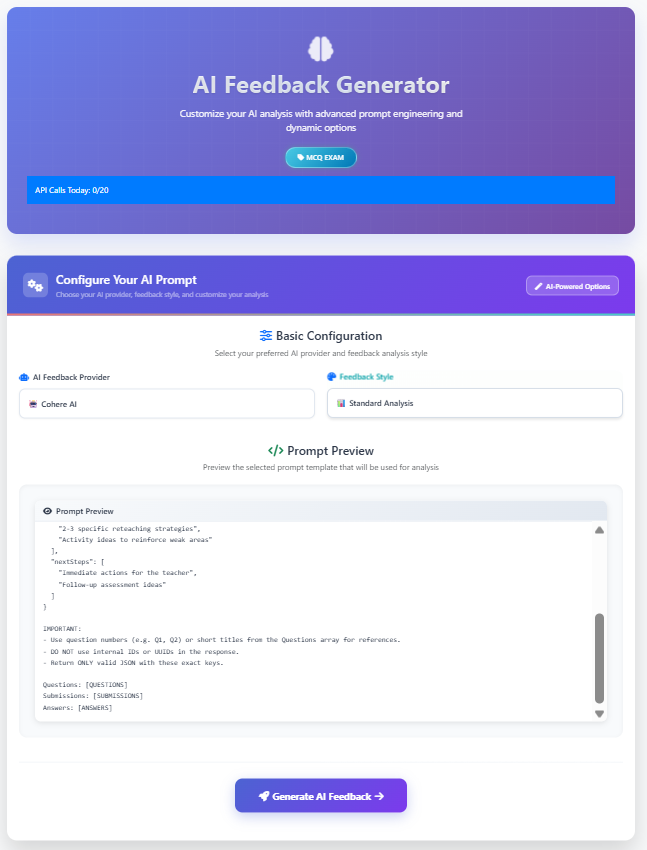
</div>

This interface enables teachers to generate automated feedback for selected exams using AI models. The page dynamically adapts based on the **exam type** (MCQ, Code, or Essay), offering tailored feedback prompts.

---


### 🔹 Features

- **AI Feedback Provider**
  - Dropdown selection to choose between different AI engines.
  - Currently supported:
    - **Cohere AI**
    - **OpenRouter AI**

- **Feedback Style**
  - Style options are **exam-type dependent**:

    **🟦 MCQ Exam Feedback Styles**
    - Standard Analysis
    - Quick Insight
    - Detailed Report
    - Custom Prompt

    **🟩 Code Exam Feedback Styles**
    - Error Analysis
    - Optimization Tips
    - Code Style Review
    - Custom Prompt

    **🟨 Essay Exam Feedback Styles**
    - Content & Relevance Focus
    - General Essay Feedback
    - Technical Accuracy & Completeness
    - Custom Prompt

- **Custom Prompt Editor**
  - All exam types allow **Custom Prompt**, giving teachers full control to define how the feedback should be generated.
  - Once selected, the custom prompt JSON appears in an editable preview box.

---

### 📊 Prompt Preview

When a style is selected, a predefined **prompt structure** is displayed in the preview box. Teachers can review or modify it if using the custom prompt option.

> Example (MCQ Standard Prompt):


Analyze these exam results and provide feedback in this exact JSON structure:

```json
{
  "overallSummary": "Brief 2-3 sentence summary of class performance",
  "keyStrengths": [
    "List 3-5 concepts students mastered well",
    "Include specific question numbers or short titles as evidence (avoid internal IDs or UUIDs)"
  ],
  "mostMissedQuestions": [
    "Top 3-5 questions students struggled with",
    "Briefly explain the misconceptions",
    "Use question numbers or short question titles instead of technical IDs"
  ],
  "teachingSuggestions": [
    "2-3 specific reteaching strategies",
    "Activity ideas to reinforce weak areas"
  ],
  "nextSteps": [
    "Immediate actions for the teacher",
    "Follow-up assessment ideas"
  ]
}

```
IMPORTANT:
- Use question numbers (e.g. Q1, Q2) or short titles from the Questions array for references.
- DO NOT use internal IDs or UUIDs in the response.
- Return ONLY valid JSON with these exact keys.

Questions: [QUESTIONS]
Submissions: [SUBMISSIONS]
Answers: [ANSWERS]


## ⛔ API Call Limiting

To maintain system performance and ensure fair usage of AI resources, the **AI Feedback Generator** includes a built-in **daily API call limit**.

### 🔢 Daily Limit

- Each user is allowed up to **10 AI feedback generations per day**.
- This applies globally to all exam types (MCQ, Code, Essay).
- The count resets automatically **at midnight (UTC)**.

### 🧠 How It Works

- A counter at the top-right corner of the interface shows:
  
  **`API Calls Today: 3/10`**

- Every time a teacher clicks **"Generate Feedback"**, it adds **1** to the count.
- Once the **limit is reached**, the system:
  - Shows a warning alert
  - Disables the **Generate Feedback** button
  - Prevents further API calls until the next day

### ⚠️ API Limit Reached — Example Message

> "You’ve reached your daily limit of 10 AI feedback requests. Please try again tomorrow."

### ✅ Best Practices

- Prioritize generating feedback only after finalizing:
  - Exam selection
  - AI provider
  - Prompt style or custom prompt
- Use the **Custom Prompt** feature to preview and edit prompts before sending to AI.
- Avoid unnecessary test clicks to preserve your quota.

### 🚀 Coming Soon (Planned Enhancements)

- Admin-configurable quota settings
- Role-based limits (e.g., more calls for premium users)
- API usage history logs

---

